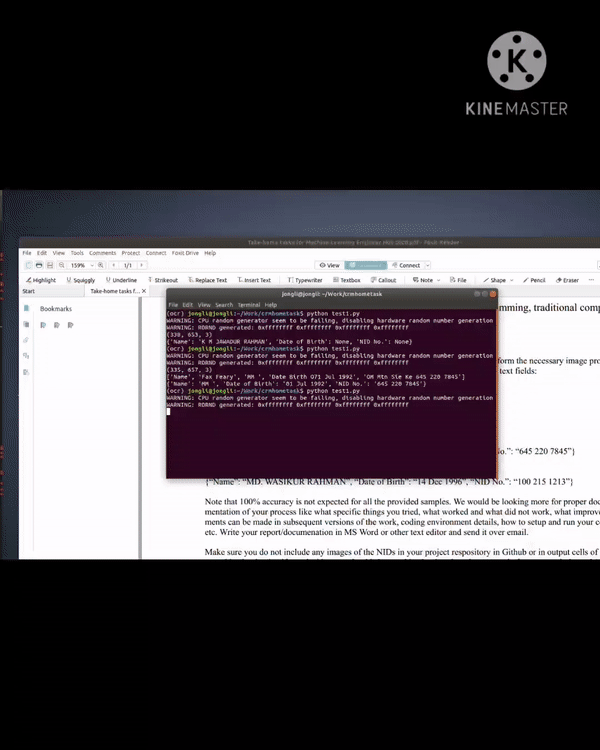

# OCR from National ID using pytesseract

## aka how to extract Name, Date of Birth and NID no. from National ID.

This code is a part of an interview process. I tried different pretrained ocr model to extract information (Name, Date of Birth and NID no.) from National ID such as kerasocr, easyocr and pytesserect and in my case pytesserect perform bettter so I just include the best performed model in this project. You have to run just a single script to perform ocr on National ID.

### Install Requirements

Below command will create a new conda env in your system and install the necessary files to run this project
```
conda env create -f requirements.yml
```

### Preparing testing datasets

* Put all your nid images in 'images' directory (Please try to put as clean image as possible)
### How to run 'ocr.py' scripts
```
python ocr.py
```
A window will come after running the script. Please select your region of interest (roi) as illustrated in gif
* If you select a wrong roi press 'r' to reset and again try to select the region.
* If you select the correct roi press 's' to save and 'c' to close the new window.
After that you can see your desire output in the terminal.


